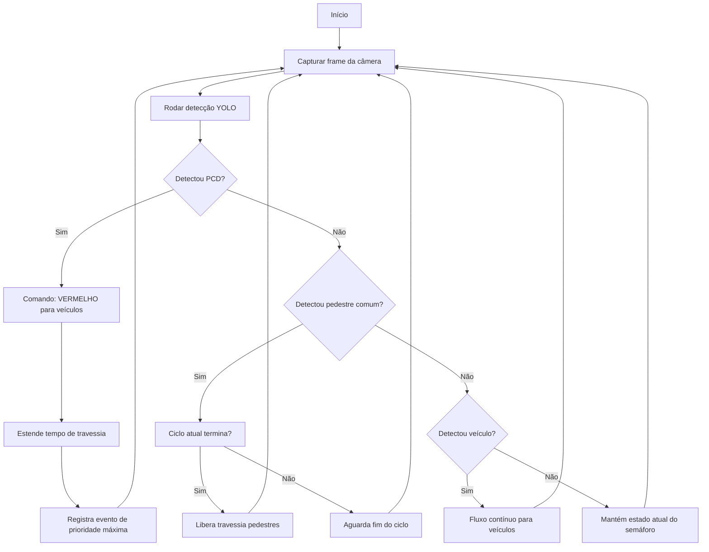

<p align="center">
   
</p>

**Sistema de controle de tráfego inteligente** que utiliza visão computacional para detectar veículos e pedestres em tempo real, controlando semáforos de forma autônoma via integração com Arduino.

---

## Descrição

O **SmarTraffic** foi desenvolvido para otimizar a mobilidade urbana. Utilizando modelos de detecção de objetos (YOLO) para identificar diferentes agentes no trânsito e tomar decisões dinâmicas sobre o estado dos semáforos.

---

## Tecnologias

| Camada          | Tecnologias                                  |
|----------------|----------------------------------------------|
| Visão Computacional | Python, YOLO (Ultralytics), OpenCV          |
| Comunicação Serial  | PySerial                                    |
| Hardware            | Arduino, LEDs (verde, amarelo, vermelho)   |
| Firmware            | C++ (Arduino IDE)                          |

---

## Funcionalidades

- Detecção em tempo real de:
  - Veículos
  - Pedestres 
- Envio de comandos via serial (Python → Arduino)
- Controle autônomo do semáforo (verde → amarelo → vermelho)
- Lógica com **limiar de ativação** para evitar trocas constantes de estado

---

## Estrutura do Repositório

O projeto está organizado em **4 repositórios principais**:
```
smartraffic/
├── computer-vision/ -> Python + YOLO + OpenCV
├── arduino/ -> Firmware C++ para Arduino
├── artefacts/ -> Artefatos do projeto (diagramas, imagens, etc.)
└── docs/ -> Website do projeto + documentação técnica
```
---

## Fluxograma


